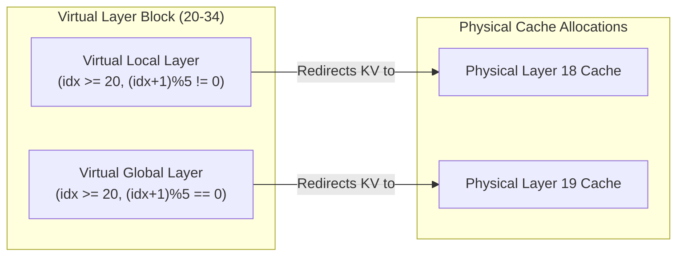
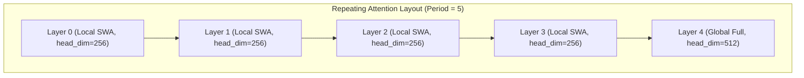

# 🧬 Google Gemma 4 (2B / E2B) Technical Specifications

This document outlines the detailed technical specifications, architectural parameters, and edge-focused design patterns of the **Google Gemma 4 Effective 2B** model (`google/gemma-4-E2B-it`). 

Released on April 2, 2026, the Gemma 4 E2B model is optimized specifically for mobile, browser, and edge deployment through several cutting-edge architectural features.

---

## 📊 Core Architectural Specs

| Feature | Gemma 4 E2B Specifications |
| :--- | :--- |
| **Model Name/Path** | `google/gemma-4-E2B-it` (Instruct-tuned) / `google/gemma-4-E2B` (Base) |
| **Effective Parameters** | **2.3 Billion** (active parameters computed per-token) |
| **Total Parameter Count** | **5.1 Billion** (including Per-Layer Embeddings) |
| **Model Architecture Class** | `Gemma4ForConditionalGeneration` |
| **Context Window** | **128K (131,072) tokens** |
| **Vocab Size** | **262,144 tokens** |
| **Input Modalities** | **Text, Image, and Audio** |
| **Decoder Layers (`num_hidden_layers`)** | **35** |
| **Hidden Dimension (`hidden_size`)** | **1,536** |
| **Intermediate Size (MLP)** | **6,144** (Standard) / **12,288** (Double-wide on layers 15-34) |
| **Attention Heads (`num_attention_heads`)** | **8** |
| **Key-Value Heads (`num_key_value_heads`)** | **1** |
| **Logit Softcapping** | `final_logit_softcapping = 30.0` |
| **License** | Apache 2.0 |

---

## 🧠 Core Architectural Innovations

Gemma 4 E2B introduces two primary architectural innovations designed to maximize intelligence while constraining active execution memory and compute overhead:

### 1. Per-Layer Embeddings (PLE)
The **"E"** in E2B stands for **"Effective"** parameters. Standard transformer models share a single global embedding table at the input and output. Gemma 4 E2B implements **Per-Layer Embeddings (PLE)**:
* **The Concept**: Each of the 35 transformer layers has its own specialized parallel token embedding lookup table. 
* **The Benefit**: Looking up embeddings is computationally cheap (O(1) memory lookup) but highly expressive. By shifting representational capacity into memory-heavy lookup tables, the core transformer attention and MLP matrices can remain incredibly small.
* **Result**: The model achieves the reasoning capability of a much larger dense network while keeping active FLOPS and latency at a 2.3B parameter level.

### 2. Shared-Layer KV Redirection (Parameter Sharing)
To minimize memory footprint during active serving and keep the active Key-Value (KV) cache small, Gemma 4 E2B implements deep KV parameter sharing:
* **Physical Decoder Blocks**: Only **20 physical layers** exist (layers `0` to `19`).
* **Virtual Decoder Blocks**: **15 virtual layers** exist (layers `20` to `34`).
* **Redirection Mechanics**: Virtual layers do not allocate new cache tensors. Instead, they redirect and overwrite physical KV projection parameters and caches during forward execution:
  * **Virtual Local Layers** (`idx >= 20` and `(idx + 1) % 5 != 0`) route to physical **Layer 18**.
  * **Virtual Global Layers** (`idx >= 20` and `(idx + 1) % 5 == 0`) route to physical **Layer 19**.



---

## 🔄 Hybrid Local-Global Attention Pattern

To optimize both context processing speeds and memory utilization over its 128K context window, Gemma 4 E2B alternates between local **Sliding Window Attention (SWA)** and **Global Attention** layers. This attention pattern repeats in cycles of **5 layers**:

### 1. Local Sliding Window Attention (SWA)
* **Frequency**: Layers 0, 1, 2, 3 (repeated every 5 layers, `(idx + 1) % 5 != 0`).
* **Head Dimension**: `256`
* **SWA Window Size**: `512` tokens
* **RoPE Theta**: `10,000.0`

### 2. Global Full Attention
* **Frequency**: Layer 4 (repeated every 5 layers, `(idx + 1) % 5 == 0`).
* **Head Dimension**: `512`
* **Context Span**: Global (entire 128K context)
* **RoPE Theta**: `1,000,000.0` (with `partial_rotary_factor = 0.25`)



> [!NOTE]
> Standard attention kernels (e.g. FlashAttention-2) are typical capped at `head_dim <= 256`. Servings stacks must be patched (such as forcing Triton attention or custom-compiled AWS Neuron graphs) to support the mixed head dimensions (256 vs 512) utilized in this hybrid pattern without crashing on global layers.

---

## 🎙 Multimodal Processing Capabilites

Gemma 4 E2B is uniquely native to multimodal edge use-cases, containing built-in lightweight multimodal encoders:
* **Audio Encoder**: A highly compressed **~300 Million** parameter audio processing module native to the model architecture.
* **Vision Encoder**: A highly optimized **~150 Million** parameter visual feature extractor.
* **SRE Deployment Configuration**: In text-only serving contexts (such as high-speed backend execution), multimedia features can be explicitly disabled via serving variables to drastically lower memory usage:
  ```bash
  --limit-mm-per-prompt '{"image": 0, "audio": 0}'
  ```

---

## 💻 Hardware Sizing & Memory Footprint

| Precision | Model Weight Size | Typical Active Serving RAM | Target Devices |
| :--- | :--- | :--- | :--- |
| **BF16 / FP16** | ~10.2 GB | ~12 - 16 GB (with 4K KV cache) | MacBooks (16GB+), Workstations, Cloud Accelerators |
| **INT8 Quantized** | ~5.1 GB | ~6 - 8 GB | Standard PC, iOS/Android High-end Devices |
| **INT4 Quantized** | ~2.6 GB | ~3.5 - 4.5 GB | Ultra-mobile Devices, Web Browsers (WebGPU) |

> [!TIP]
> When serving on cloud hardware such as **AWS Inferentia2** (`inf2`), Gemma 4 E2B requires a Tensor Parallelism of 2 (`--tensor-parallel-size 2`) to balance across the physical cores of a single `/dev/neuron0` chip, delivering massive cost savings and high tokens-per-second throughput.
